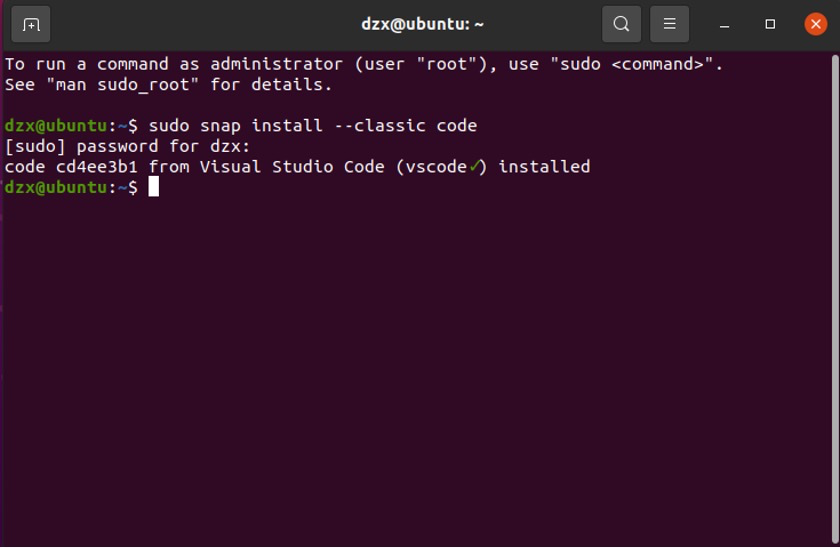
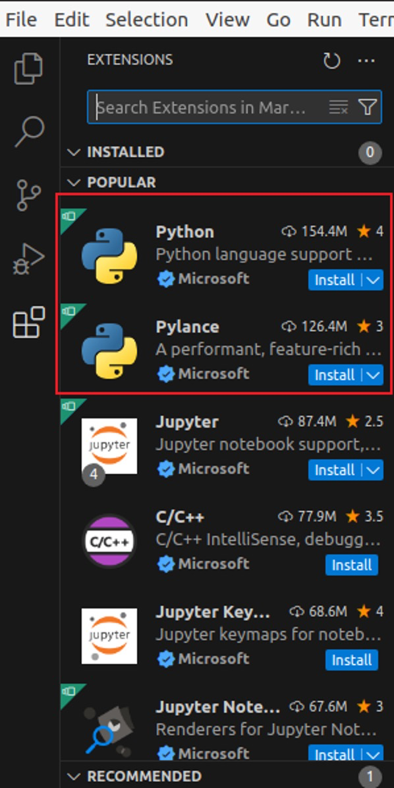
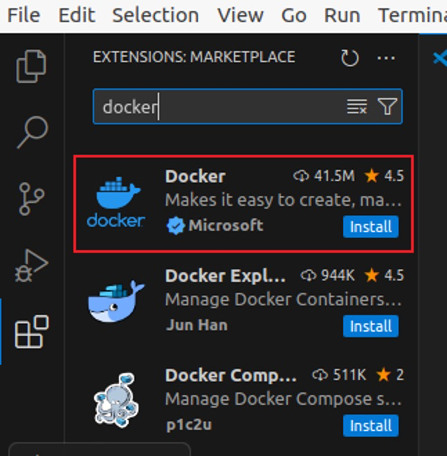
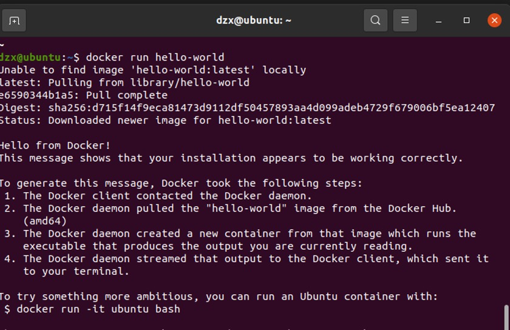
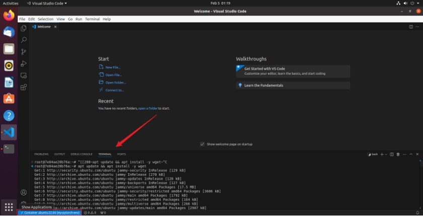
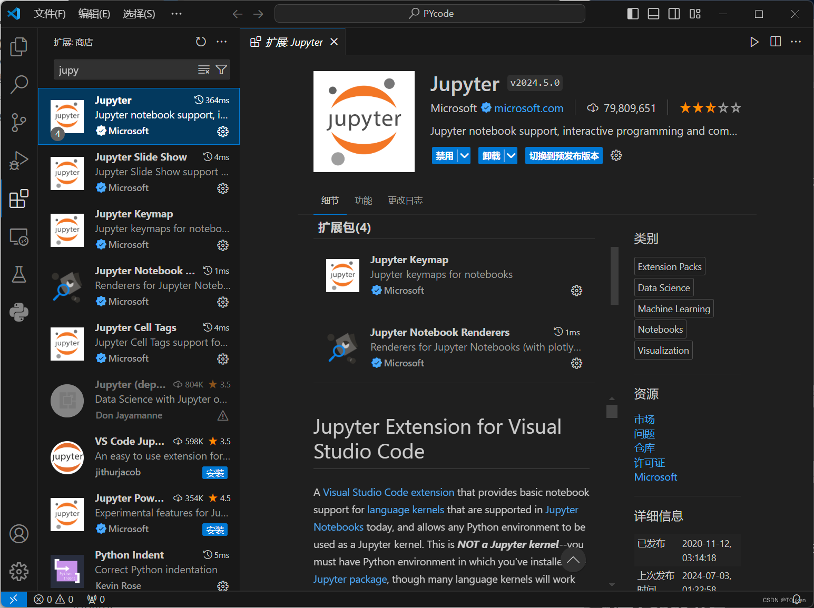

!!! tip "小贴士"
    在使用之前，请先参考[实验一介绍](./实验一介绍.md)，了解实验要求和实验内容。

### **一、安装 Visual Studio Code (VSCode)**

Visual Studio Code（简称 VSCode）是一款轻量级但功能强大的代码编辑器，适用于多种编程语言和开发环境。以下是安装 VSCode 的主要优势：

1. **跨平台支持**：VSCode 可在 Windows、macOS 和 Linux 上运行，确保开发环境的一致性。
2. **丰富的扩展生态**：提供大量扩展插件，如 Python、Docker、Jupyter Notebook、GitHub Copilot 等，提升开发效率。
3. **内置 Git 集成**：方便进行版本控制和代码协作。
4. **智能代码补全**：内置 IntelliSense，支持智能代码补全、语法高亮和调试功能。
5. **轻量级但强大**：相比传统 IDE（如 PyCharm、Eclipse），VSCode 占用资源较少，启动速度快，适合日常开发。
6. **终端集成**：可以在 VSCode 内直接运行终端命令，无需切换窗口。
7. **良好的调试支持**：内置调试工具，支持 Python、JavaScript、C++ 等多种语言。

方法1：通过 Snap 安装（推荐）

打开terminal输入：

```bash
sudo snap install --classic code
```



??? note "方法2：通过APT仓库安装"

    ```bash
    sudo apt update
    sudo apt install -y software-properties-common apt-transport-https wget
    wget -qO- https://packages.microsoft.com/keys/microsoft.asc | gpg --dearmor > packages.microsoft.gpg
    sudo install -o root -g root -m 644 packages.microsoft.gpg /etc/apt/trusted.gpg.d/
    ```

#### 启动VSCode：

```bash
code
```

> 提示：安装完成后，打开VSCode并安装 **扩展**（后续步骤需要）。

打开 VSCode，按 `Ctrl + Shift + X` 打开扩展市场，搜索并安装以下扩展：

1. **Python**（提供 Python 代码支持）
2. **Pylance**（提供更好的代码补全和类型检查）
3. **Jupyter**（支持 Jupyter Notebook）
4. **Docker**（如果要使用 Docker）

**解释：**

- **Python** 扩展提供代码高亮、调试、格式化等功能。
- **Pylance** 提供增强的类型推断和智能补全。
- **Jupyter** 允许在 VSCode 里运行 Jupyter Notebook。
- **Docker** 扩展帮助管理和调试 Docker 容器。





---

### **二、安装 Docker**

#### Docker 的主要优点：

1. **环境隔离**：每个 Docker 容器都是独立的环境，不会影响宿主机或其他容器。
2. **跨平台兼容性**：在不同操作系统上运行相同的 Docker 容器，不用担心环境差异。
3. **易于部署**：可以快速创建、复制和销毁容器，使得开发和生产环境保持一致。
4. **资源高效**：相比虚拟机，Docker 容器占用的系统资源更少，启动速度更快。
5. **依赖管理**：Docker 容器包含所有依赖项，避免了“在我机器上可以跑”的问题。

#### 为什么使用 Docker？

- **简化开发环境配置**：开发者可以直接使用 Docker 容器，而无需手动安装复杂的软件依赖。
- **提高团队协作效率**：团队成员可以共享相同的 Docker 镜像，确保环境一致。
- **方便 CI/CD 集成**：Docker 允许在 CI/CD 流水线中构建和部署应用，提高自动化能力。
- **易于扩展和管理**：可以通过 Docker Compose 轻松管理多个容器，适用于微服务架构。

#### 如何安装 Docker？

#### 1. 卸载旧版本（如有）

```bash
sudo apt remove docker docker-engine docker.io containerd runc
```

#### 2. 安装 Docker 官方版本

```bash
sudo apt update
sudo apt install -y ca-certificates curl gnupg
sudo mkdir -m 0755 -p /etc/apt/keyrings
curl -fsSL https://download.docker.com/linux/ubuntu/gpg | sudo gpg --dearmor -o /etc/apt/keyrings/docker.gpg
echo "deb [arch=$(dpkg --print-architecture) signed-by=/etc/apt/keyrings/docker.gpg] https://download.docker.com/linux/ubuntu $(lsb_release -cs) stable" | sudo tee /etc/apt/sources.list.d/docker.list > /dev/null
sudo apt update
sudo apt install -y docker-ce docker-ce-cli containerd.io docker-buildx-plugin docker-compose-plugin
```

#### 3. 配置用户权限

```bash
sudo usermod -aG docker $USER
newgrp docker  # 或注销后重新登录
```

#### 4. 配置镜像源（可选）

```bash
sudo mkdir -p /etc/docker
sudo tee /etc/docker/daemon.json <<-'EOF'
{
    "registry-mirrors": [
        "https://do.nark.eu.org",
        "https://dc.j8.work",
        "https://docker.m.daocloud.io",
        "https://dockerproxy.com",
        "https://docker.mirrors.ustc.edu.cn",
        "https://docker.nju.edu.cn"
    ]
}
EOF
sudo systemctl daemon-reload
sudo systemctl restart docker
```


#### 5. 验证安装

```bash
docker run hello-world
```



---

### **三、配置 VSCode 使用 Docker**

通过 VSCode 的 Docker 扩展，可以直接在编辑器内管理容器、镜像、Docker Compose 以及 Kubernetes 资源。

#### 1. 安装 Docker 扩展

- 在VSCode中搜索并安装 **Docker** 扩展（Microsoft官方出品）。

#### 2. 创建并运行一个基础容器

```bash
docker run -it --name my-pytorch-env -v ${PWD}:/workspace ubuntu:22.04 /bin/bash
```

> 参数说明：  
>
> - `-it`：交互模式  
> - `--name`：容器名称  
> - `-v`：挂载主机目录到容器（方便代码同步）  
> - `ubuntu:22.04`：基础镜像

#### 3. 在VSCode中连接容器

- 点击VSCode左下角 **><** 按钮，选择 **Attach to Running Container**，选择刚创建的容器。

---

### **四、Docker容器内配置 Conda 和 PyTorch**

在容器docker内操作：



#### 1. 在容器内安装 Miniconda

```bash
apt update && apt install -y wget
wget https://repo.anaconda.com/miniconda/Miniconda3-latest-Linux-x86_64.sh
bash Miniconda3-latest-Linux-x86_64.sh -b
echo 'export PATH="/root/miniconda3/bin:$PATH"' >> ~/.bashrc
source ~/.bashrc
conda init
```

#### 2. 创建 PyTorch 环境

```bash
conda create -n pytorch python=3.10 -y
conda activate pytorch
conda install pytorch torchvision torchaudio pytorch-cuda=12.1 -c pytorch -c nvidia
```

#### 3. 验证 PyTorch

```python
python -c "import torch; print(torch.__version__); print(torch.cuda.is_available())"
```

---

### **五、Jupyter Notebook使用**

> [!NOTE]
>
> 实验所需的jupyter notebook在课程附件中。

Jupyter Notebook 是一种非常流行的工具，尤其在数据科学、机器学习以及深度学习领域，用于交互式编程和分析。你可以在其中编写和运行 Python 代码，还能即时查看代码输出和生成图表。它支持 Markdown 和 LaTeX，适合进行数据分析报告或实验记录。

#### **1. Jupyter Notebook 安装**

**通过pip安装**：

可以通过 Python 的包管理器 pip 安装 Jupyter Notebook：

```bash
pip install jupyter
```

安装完成后，可以通过在命令行中输入` jupyter notebook ` 启动它。

#### **2. 在 VSCode 中使用 Jupyter Notebook（推荐）**

VSCode 是一个非常强大的代码编辑器，并且支持 Jupyter Notebook 的运行。以下是如何在 VSCode 中使用 Jupyter Notebook：

首先在vscode中安装Jupyter插件：



**使用 Jupyter Notebook**：

在右上角可以选择我们之前安装好的python环境


**运行代码**：

在打开的 Notebook 文件中，你可以像在 Jupyter Notebook 中一样运行代码单元（cells）。每个单元格可以是 Python 代码，也可以是 Markdown，用于文档编写。


### **六、导出与导入 Docker 容器**

> **在terminal中运行以下命令**

#### 1. 导出容器为镜像

```bash
docker commit my-pytorch-env my-pytorch-image:latest
```

**解释：**

​	•	`docker commit`：用于创建新的镜像，该镜像基于一个已运行的容器的当前状态。

​	•	`my-pytorch-env`：这是正在运行的容器的名称或 ID，该容器的状态会被保存为一个新的镜像。

​	•	`my-pytorch-image:latest`：指定新镜像的名称（my-pytorch-image）和标签（:latest，表示最新版本）。


**作用：**

这个命令会将 my-pytorch-env 容器的当前文件系统及其状态打包成一个新的 Docker 镜像 my-pytorch-image:latest，这样以后可以使用该镜像创建新的容器。

#### 2. 导出镜像为文件

```bash
docker save -o my-pytorch-image.tar my-pytorch-image:latest
```

**解释：**

​	•	`docker save`：用于将一个或多个镜像保存为 tar 文件，以便在其他环境中导入。

​	•	`-o my-pytorch-image.tar`：指定输出的文件路径，这里保存为 my-pytorch-image.tar。

​	•	`my-pytorch-image:latest`：要导出的 Docker 镜像的名称和标签。


**作用：**

这个命令将 my-pytorch-image:latest 以 tar 归档文件的形式保存到本地文件 my-pytorch-image.tar，这样可以方便地在其他计算机或系统中传输和恢复。

#### 3. 导入镜像

```bash
docker load -i my-pytorch-image.tar
```

**解释：**

​	•	`docker load`：用于从 tar 文件中加载 Docker 镜像。

​	•	`-i my-pytorch-image.tar`：指定要加载的 tar 归档文件。


**作用：**

这个命令会将 my-pytorch-image.tar 中的镜像重新加载到 Docker 中，使其可以像普通的 Docker 镜像一样使用。

#### 4. 运行导入的镜像

```bash
docker run -it --name restored-pytorch-env -v ${PWD}:/workspace my-pytorch-image:latest /bin/bash
```

**解释：**

​	•	`docker run`：创建并运行一个新的容器。

​	•	`-it`：

​	•	`-i（interactive）`：保持容器的标准输入（STDIN）打开，使其可以交互式操作。

​	•	`-t（tty）`：分配一个伪终端，允许用户在容器内部运行命令（如 bash）。

​	•	`--name restored-pytorch-env`：为新创建的容器指定名称 restored-pytorch-env，便于管理。

​	•	`-v \${PWD}:/workspace`：挂载当前目录（${PWD}）到容器的 /workspace 目录，方便在宿主机和容器之间共享数据。

​	•	`my-pytorch-image:latest`：指定用于创建容器的镜像。

​	•	`/bin/bash`：在新容器中运行 bash 进程，使用户可以进入交互式 Shell。

**作用：**

这个命令会基于 my-pytorch-image:latest 运行一个新的容器，并提供一个交互式 Shell，用户可以在其中运行 PyTorch 或其他程序。

---

### **常见问题**

1. **Docker权限问题**：确保用户已加入 `docker` 组。

2. **CUDA不可用**：安装NVIDIA Container Toolkit（需GPU支持）：

   ```bash
   sudo apt install -y nvidia-container-toolkit
   sudo systemctl restart docker
   ```

3. **Conda环境未激活**：在容器启动后手动执行 `conda activate pytorch`
4. **无法拉取镜像**：请检查是否已配置镜像源，并确保网络连接正常。