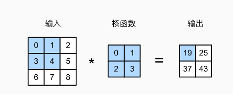

# 图像卷积
## 互相关运算
如图中所示，考虑一个3x3矩阵作为输入张量，卷积核定义为一个2x2矩阵。



在二维互相关运算中，卷积窗口从输入张量的左上角开始，从左到右、从上到下滑动。 
当卷积窗口滑动到新一个位置时，包含在该窗口中的部分张量与卷积核张量进行按元素相乘，
得到的张量再求和得到一个单一的标量值，由此我们得出了这一位置的输出张量值。 
在如上例子中，输出张量的四个元素由二维互相关运算得到，这个输出高度为2、宽度为2

具体计算过程如下所示


注意，输出大小略小于输入大小。这是因为卷积核的宽度和高度大于1， 而卷积核只与图像中
每个大小完全适合的位置进行互相关运算。给出如下计算公式计算输出矩阵的大小。


在之前图中例子中，输入为3x3张量，卷积核为2x2张量，那么输出张量形状则为(3-2+1)x
(3-2+1)

接下来，我们在corr2d函数中实现如上过程，该函数接受输入张量X和卷积核张量K，
并返回输出张量Y

```bash
import torch
from torch import nn

def corr2d(X, K):  #@save
    """计算二维互相关运算"""
    h, w = K.shape
    Y = torch.zeros((X.shape[0] - h + 1, X.shape[1] - w + 1))
    for i in range(Y.shape[0]):
        for j in range(Y.shape[1]):
            Y[i, j] = (X[i:i + h, j:j + w] * K).sum()
    return Y
```
测试
```bash
X = torch.tensor([[0.0, 1.0, 2.0], [3.0, 4.0, 5.0], [6.0, 7.0, 8.0]])
K = torch.tensor([[0.0, 1.0], [2.0, 3.0]])
corr2d(X, K)
```
输出
```bash
tensor([[19., 25.],
        [37., 43.]])
```
卷积层对输入和卷积核权重进行互相关运算，并在添加标量偏置之后产生输出。 所以，
卷积层中的两个被训练的参数是卷积核权重和标量偏置。 就像我们之前随机初始化全连接
层一样，在训练基于卷积层的模型时，我们也随机初始化卷积核权重。

基于上面定义的corr2d函数实现二维卷积层。在__init__构造函数中，将weight
和bias声明为两个模型参数。前向传播函数调用corr2d函数并添加偏置。

```bash
class Conv2D(nn.Module):
    def __init__(self, kernel_size):
        super().__init__()
        self.weight = nn.Parameter(torch.rand(kernel_size))
        self.bias = nn.Parameter(torch.zeros(1))

    def forward(self, x):
        return corr2d(x, self.weight) + self.bias
```

