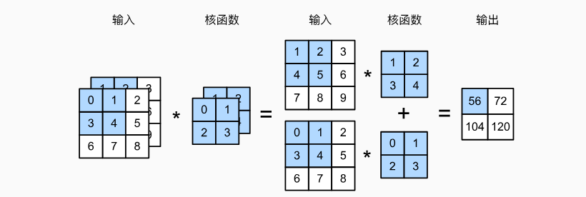

# 多输入输出通道
彩色图像具有标准的RGB通道来代表红、绿和蓝。 但是到目前为止，我们仅展示了单个输入
和单个输出通道的简化例子。 这使得我们可以将输入、卷积核和输出看作二维张量。

当我们添加通道时，我们的输入和隐藏的表示都变成了三维张量。例如，每个RGB输入图像
具有3 x h x w 的形状。我们将这个大小为3的轴称为通道（channel）维度。
本节将更深入地研究具有多输入和多输出通道的卷积核。
## 多输入通道

当输入包含多个通道时，需要构造一个与输入数据具有
相同输入通道数的卷积核，以便与输入数据进行互相关运算。



如图中所示，现在输入形状为2x3x3，即有两个通道，卷积核形状为2x2x2。
图中加深部分计算过程为：(1x1+2x2+4x3+5x4)+(0x0+1x1+3x2+4x3)=56

```bash
import torch
from torch import nn

def corr2d(X, K):  #@save
    """计算二维互相关运算"""
    h, w = K.shape
    Y = torch.zeros((X.shape[0] - h + 1, X.shape[1] - w + 1))
    for i in range(Y.shape[0]):
        for j in range(Y.shape[1]):
            Y[i, j] = (X[i:i + h, j:j + w] * K).sum()
    return Y
    
import torch

def corr2d_multi_in(X, K):
    # 先遍历“X”和“K”的第0个维度（通道维度），再把它们加在一起
    return sum(corr2d(x, k) for x, k in zip(X, K))
```
构造与图中相同输入与卷积核
```bash
X = torch.tensor([[[0.0, 1.0, 2.0], [3.0, 4.0, 5.0], [6.0, 7.0, 8.0]],
               [[1.0, 2.0, 3.0], [4.0, 5.0, 6.0], [7.0, 8.0, 9.0]]])
K = torch.tensor([[[0.0, 1.0], [2.0, 3.0]], [[1.0, 2.0], [3.0, 4.0]]])

corr2d_multi_in(X, K)
```
输出：
```bash
tensor([[ 56.,  72.],
        [104., 120.]])
```

## 多输出通道
到目前为止，不论有多少输入通道，我们还只有一个输出通道。在最流行的神经网络架构中
，随着神经网络层数的加深， 我们常会增加输出通道的维数，
通过减少空间分辨率以获得更大的通道深度。


举例来说，如上图所示，输入形状为3x3x3，卷积核为3x1x1x2，
卷积核第一个维度表示3个输入通道,(注意，在实际应用中各个维度代表的含义根据例子
来决定)，
最后一个维度表示2个输出通道，输出形状为2x3x3


如下所示，我们实现一个计算多个通道的输出的互相关函数。
```bash
def corr2d_multi_in_out(X, K):
    # 迭代“K”的第0个维度，每次都对输入“X”执行互相关运算。
    # 最后将所有结果都叠加在一起
    return torch.stack([corr2d_multi_in(X, k) for k in K], 0)

K = torch.stack((K, K + 1, K + 2), 0)
K.shape 
```
结果如下，在这里我们的输出通道放在第0维：
```bash
torch.Size([3, 2, 2, 2])
```

下面，我们对输入张量X与卷积核张量K执行互相关运算。现在的输出包含3
个通道，
```bash
X = torch.tensor([[[0.0, 1.0, 2.0], [3.0, 4.0, 5.0], [6.0, 7.0, 8.0]],
               [[1.0, 2.0, 3.0], [4.0, 5.0, 6.0], [7.0, 8.0, 9.0]]])
corr2d_multi_in_out(X, K)
```
```bash
tensor([[[ 56.,  72.],
         [104., 120.]],

        [[ 76., 100.],
         [148., 172.]],

        [[ 96., 128.],
         [192., 224.]]])
```