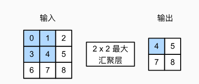

# 汇聚层

通常当我们处理图像时，我们希望逐渐降低隐藏表示的空间分辨率、聚集信息，
这样随着我们在神经网络中层叠的上升，每个神经元对其敏感的感受野（输入）就越大。

本节将介绍汇聚（pooling）层，它具有双重目的：
降低卷积层对位置的敏感性，同时降低对空间降采样表示的敏感性。

## 最大汇聚层和平均汇聚层
与卷积层类似，汇聚层运算符由一个固定形状的窗口组成，该窗口根据其步幅大小在输入的
所有区域上滑动，为固定形状窗口（有时称为汇聚窗口）遍历的每个位置计算一个输出。 
然而，不同于卷积层中的输入与卷积核之间的互相关计算，汇聚层不包含参数。
相反，池运算是确定性的，我们通常计算汇聚窗口中所有元素的最大值或平均值。
这些操作分别称为最大汇聚层（maximum pooling）和平均汇聚层（average pooling）。

在这两种情况下，与互相关运算符一样，
汇聚窗口从输入张量的左上角开始，从左往右、从上往下的在输入张量内滑动。
在汇聚窗口到达的每个位置，它计算该窗口中输入子张量的最大值或平均值。
计算最大值或平均值是取决于使用了最大汇聚层还是平均汇聚层。



图中的输出张量的高度为2，宽度为2 。这四个元素为每个汇聚窗口中的最大值：


在下面的代码中的pool2d函数，我们实现汇聚层的前向传播。
然而，这里我们没有卷积核，输出为输入中每个区域的最大值或平均值。

```bash
import torch
from torch import nn

def pool2d(X, pool_size, mode='max'):
    p_h, p_w = pool_size
    Y = torch.zeros((X.shape[0] - p_h + 1, X.shape[1] - p_w + 1))
    for i in range(Y.shape[0]):
        for j in range(Y.shape[1]):
            if mode == 'max':
                Y[i, j] = X[i: i + p_h, j: j + p_w].max()
            elif mode == 'avg':
                Y[i, j] = X[i: i + p_h, j: j + p_w].mean()
    return Y
```
构造输入：
```bash
X = torch.tensor([[0.0, 1.0, 2.0], [3.0, 4.0, 5.0], [6.0, 7.0, 8.0]])
pool2d(X, (2, 2))
```
输出为：
```bash
tensor([[4., 5.],
        [7., 8.]])
```
此外，我们还可以验证平均汇聚层。
```bash
pool2d(X, (2, 2), 'avg')
```
```bash
tensor([[2., 3.],
        [5., 6.]])
```
## 填充与步幅

与卷积层一样，汇聚层也可以改变输出形状。和以前一样，
我们可以通过填充和步幅以获得所需的输出形状。 
下面，我们用深度学习框架中内置的二维最大汇聚层，
来演示汇聚层中填充和步幅的使用。 
我们首先构造了一个输入张量X，它有四个维度，其中样本数和通道数都是1。
```bash
X = torch.arange(16, dtype=torch.float32).reshape((1, 1, 4, 4))
X
```
```bash 
tensor([[[[ 0.,  1.,  2.,  3.],
          [ 4.,  5.,  6.,  7.],
          [ 8.,  9., 10., 11.],
          [12., 13., 14., 15.]]]])
```
默认情况下，深度学习框架中的步幅与汇聚窗口的大小相同。 
因此，如果我们使用形状为(3, 3)的汇聚窗口，
那么默认情况下，我们得到的步幅形状为(3, 3)。
```bash
pool2d = nn.MaxPool2d(3)
pool2d(X)
```
```bash
tensor([[[[10.]]]])
```

## 多个通道
在处理多通道输入数据时，汇聚层在每个输入通道上单独运算，
而不是像卷积层一样在通道上对输入进行汇总。
这意味着汇聚层的输出通道数与输入通道数相同。 
下面，我们将在通道维度上连结张量X和X + 1，以构建具有2个通道的输入。

```bash
X = torch.cat((X, X + 1), 1)
X
```
```bash
tensor([[[[ 0.,  1.,  2.,  3.],
          [ 4.,  5.,  6.,  7.],
          [ 8.,  9., 10., 11.],
          [12., 13., 14., 15.]],

         [[ 1.,  2.,  3.,  4.],
          [ 5.,  6.,  7.,  8.],
          [ 9., 10., 11., 12.],
          [13., 14., 15., 16.]]]])
```
如下所示，汇聚后输出通道的数量仍然是2。
```bash
pool2d = nn.MaxPool2d(3, padding=1, stride=2)
pool2d(X)
```
```bash
tensor([[[[ 5.,  7.],
          [13., 15.]],

         [[ 6.,  8.],
          [14., 16.]]]])
```