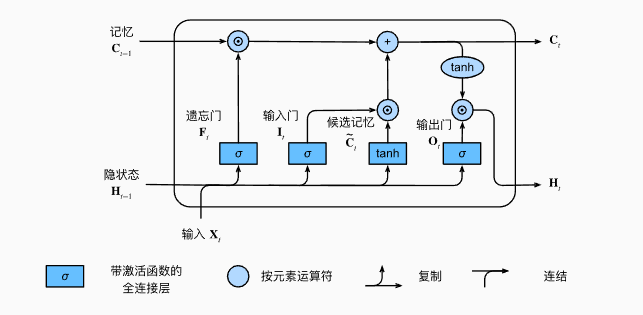
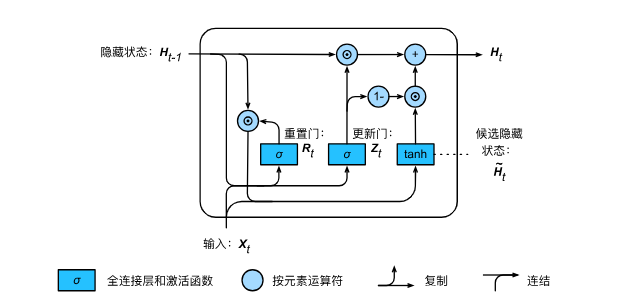

# 实验任务二: RNN、LSTM和GRU文本生成任务

## **1. 文本预处理**
!!! info "文本预处理简介"
    文本预处理是在深度学习和自然语言处理（NLP）任务中，对原始文本进行清理、转换和格式化，使其能够被模型理解和处理的过程。

!!! warning "预处理的必要性"
    原始文本可能包含噪声，且文本长度不一致，导致批量训练时需要填充

!!! info "AG News 数据集简介"
    AG News 数据集来源于 AG's corpus of news articles，是一个大型的新闻数据集，由 Antonio Gulli 从多个新闻网站收集整理。
    AG News 数据集包含 4 类新闻，每类 30,000 条训练数据，共 120,000 条训练样本 和 7,600 条测试样本。

首先导入所需模块：

!!! warning "可能需要安装datasets包"
```bash
   pip install datasets
```

```python
import torch
import torch.nn as nn
import torch.optim as optim
from datasets import load_dataset, load_from_disk
from collections import Counter
from torch.nn.utils.rnn import pad_sequence
import torch.nn.functional as F
from tqdm import tqdm
import os
```

我们从AG News 数据集中加载文本。 这是一个较小的语料库，有150000多个单词，但足够我们小试牛刀.


```python
data_path = "ag_news文件夹保存路径"
dataset = load_from_disk(data_path)

# 提取所有文本数据
train_text = [item['text'] for item in dataset['train']]

device = torch.device("cuda" if torch.cuda.is_available() else "cpu")
```

词元化
下面的tokenize函数将文本行列表（lines）作为输入， 列表中的每个元素是一个文本序列（如一条文本行）。 每个文本序列又被拆分成一个词元列表，词元（token）是文本的基本单位。 最后，返回一个由词元列表组成的列表，其中的每个词元都是一个字符串（string）。


```python
# 使用 split 进行分词
def tokenize(text):
    return text.lower().split()

# 生成词汇表
counter = Counter()
for text in train_text:
    counter.update(tokenize(text))
```

词元的类型是字符串，而模型需要的输入是数字，因此这种类型不方便模型使用。 现在，让我们构建一个字典，通常也叫做词表（vocabulary）， 用来将字符串类型的词元映射到从0开始的数字索引中。
首先，定义特殊标记（如 <unk> 代表未知词，<pad> 用于序列填充，<bos>表示序列开始，<eos>表示序列结束）。然后，从 Counter 统计的单词频率列表中提取所有单词，并按频率排序，将其添加到词汇表中。最后，使用 enumerate 为每个单词分配唯一索引，创建一个 word-to-index 映射，方便将文本转换为数值序列供深度学习模型使用。

```python
# 生成词汇表，包含特殊 token
special_tokens = ["<unk>", "<pad>", "<bos>", "<eos>"]
vocab = special_tokens + [word for word, _ in counter.most_common()]
vocab_dict = {word: idx for idx, word in enumerate(vocab)}
```

打印词汇表大小，前10个高频词元及其索引。


```python
print("词汇表大小:", len(vocab_dict))
print("前 10 个最常见的单词及其索引:")
#TODO:打印前10个高频词元及其索引
```


!!! question "思考题"
    思考题1：在文本处理中，为什么需要对文本进行分词（Tokenization）？

    思考题2：在深度学习中，为什么不能直接使用单词而需要将其转换为索引？


## **2. RNN文本生成实验**

!!! abstract "RNN文本生成概述"
    使用RNN进行文本生成任务的核心思想是 根据前面的文本预测下一个单词，然后将预测出的单词作为输入，循环迭代生成完整文本。本实验以AG News 数据为例，给定前100个单词作为输入，预测下一个单词，实现文本生成任务。

!!! warning "RNN的局限性"
    RNN的局限性在于难以记住长距离上下文，容易导致生成内容缺乏连贯性，且可能出现重复或模式化的文本。


### 前置代码

首先导入所需模块：

```python
import torch
import torch.nn as nn
import torch.optim as optim
from datasets import load_dataset, load_from_disk
from collections import Counter
from torch.nn.utils.rnn import pad_sequence
import torch.nn.functional as F
from tqdm import tqdm
import os
```

读取数据集

```python
data_path = "ag_news文件夹保存路径"
dataset = load_from_disk(data_path)

# 提取所有文本数据
train_text = [item['text'] for item in dataset['train']]

device = torch.device("cuda" if torch.cuda.is_available() else "cpu")
```


文本的预处理


```python

# 使用 split 进行分词
def tokenize(text):
    return text.lower().split()

# 生成词汇表
counter = Counter()
for text in train_text:
    counter.update(tokenize(text))

# 生成词汇表，包含特殊 token
special_tokens = ["<unk>", "<pad>", "<bos>", "<eos>"]
vocab = special_tokens + [word for word, _ in counter.most_common()]
vocab_dict = {word: idx for idx, word in enumerate(vocab)}

```


### 训练数据生成

将文本数据转换为数值表示，并按100个单词作为输入、下一个单词作为目标的方式构造训练数据。最终生成 X_train（输入序列）和 Y_train（预测目标），用于 RNN 训练文本生成模型。

```python

def numericalize(text):
    return torch.tensor([vocab_dict.get(word, vocab_dict["<unk>"]) for word in tokenize(text)], dtype=torch.long)

# 生成训练数据（输入 100 个词，预测下一个词）
def create_data(text_list, seq_len=100):
    X, Y = [], []
    for text in text_list:
        token_ids = numericalize(text)
        if len(token_ids) <= seq_len:
            continue  # 忽略过短的文本
        for i in range(len(token_ids) - seq_len):
            X.append(token_ids[i:i + seq_len])
            Y.append(token_ids[i + seq_len])
    return torch.stack(X), torch.tensor(Y)

# 生成训练数据
X_train, Y_train = create_data(train_text, seq_len=100)
# 考虑到训练时间 只取前 20% 的数据
subset_size = int(0.2 * len(X_train))  # 计算 20% 的样本数量
X_train = X_train[:subset_size]
Y_train = Y_train[:subset_size]

# 创建 DataLoader
batch_size = 32
train_data = torch.utils.data.TensorDataset(X_train, Y_train)
train_loader = torch.utils.data.DataLoader(train_data, batch_size=batch_size, shuffle=True)

```

!!! question "思考题"
    思考题3：如果不打乱训练集，会对生成任务有什么影响？


### RNN 模型构建

实现了一个基于 RNN 的文本生成模型，通过输入文本序列预测下一个单词。

```python
class RNNTextGenerator(nn.Module):
    def __init__(self, vocab_size, embed_dim, hidden_dim, num_layers=2):
        super(RNNTextGenerator, self).__init__()
        self.embedding = nn.Embedding(vocab_size, embed_dim)#将输入的单词索引转换为 embed_dim 维的向量。
        self.rnn = nn.RNN(embed_dim, hidden_dim, num_layers=num_layers, batch_first=True)#构建一个 RNN 层，用于处理序列数据。
        self.fc = nn.Linear(hidden_dim, vocab_size)#将 RNN 隐藏状态 映射到 词汇表大小的向量，用于预测下一个单词的概率分布。

    def forward(self, x, hidden=None):
        #输入 x 形状：(batch_size, seq_len)
        #输出 embedded 形状：(batch_size, seq_len, embed_dim)
        embedded = self.embedding(x)
        #输入 embedded 形状：(batch_size, seq_len, embed_dim)
        #输出 output 形状：(batch_size, seq_len, hidden_dim)（所有时间步的隐藏状态）
        #输出 hidden 形状：(num_layers, batch_size, hidden_dim)（最后一个时间步的隐藏状态）
        output, hidden = self.rnn(embedded, hidden) 
        #只取 最后一个时间步的隐藏状态 output[:, -1, :] 作为输入
        #通过全连接层 self.fc 将隐藏状态转换为词汇表大小的分布（用于预测下一个单词）
        #最终 output 形状：(batch_size, vocab_size)
        output = self.fc(output[:, -1, :])
        return output, hidden
```

定义模型所需参数、实例化模型、损失函数和优化器

```python
embed_dim = 128
hidden_dim = 512  
vocab_size = len(vocab)

model = RNNTextGenerator(vocab_size, embed_dim, hidden_dim, num_layers=2).to(device)
criterion = nn.CrossEntropyLoss()
optimizer = optim.Adam(model.parameters(), lr=0.001)  
```

### RNN 模型训练

RNN 训练过程

```python
def train_model(model, train_loader, epochs=5):
    model.train()# 将模型设置为训练模式
    for epoch in range(epochs):
        total_loss = 0
        progress_bar = tqdm(train_loader, desc=f"Epoch {epoch + 1}/{epochs}")# 使用 tqdm 创建进度条
        epoch_grad_norm = None

        for X_batch, Y_batch in progress_bar:
            X_batch, Y_batch = X_batch.to(device), Y_batch.to(device)# 将数据移动到指定设备（GPU/CPU）
            optimizer.zero_grad()# 清空上一轮的梯度，防止梯度累积

            output, _ = model(X_batch)# 前向传播，计算模型输出
            loss = criterion(output, Y_batch) # 计算损失函数值
            loss.backward()# 反向传播，计算梯度

            optimizer.step() # 更新模型参数
            total_loss += loss.item()# 累加当前 batch 的损失值
            progress_bar.set_postfix(loss=loss.item())# 在进度条上显示当前 batch 的损失值

        print(f"Epoch {epoch + 1}, Avg Loss: {total_loss / len(train_loader):.4f}")
        # 计算并输出本轮训练的平均损失

# 训练模型
train_model(model, train_loader, epochs=20)  
```

### RNN 模型测试

RNN 生成文本测试

```python
def generate_text(model, start_text, num_words=100, temperature=1.0):
    model.eval()# 将模型设置为评估模式，禁用 dropout 和 batch normalization
    words = tokenize(start_text)# 对输入文本进行分词，获取初始词列表
    input_seq = numericalize(start_text).unsqueeze(0).to(device)
    # 将文本转换为数值表示，并调整形状以符合模型输入格式（增加 batch 维度），再移动到指定设备（CPU/GPU）

    hidden = None

    for _ in range(num_words): # 生成 num_words 个单词
        with torch.no_grad(): # 在推理时关闭梯度计算，提高效率
            output, hidden = model(input_seq, hidden)# 前向传播，获取模型输出和新的隐藏状态

        # 计算 softmax，并应用温度系数
        logits = output.squeeze(0) / temperature # 对 logits 除以 temperature 调节概率分布的平滑度
        probs = F.softmax(logits, dim=-1) # 计算 softmax 得到概率分布

        # 采样新词
        predicted_id = torch.multinomial(probs, num_samples=1).item()
        # 基于概率分布 随机采样一个词的索引

        next_word = vocab[predicted_id]  # 从词表中查找对应的单词
        words.append(next_word)# 将生成的单词添加到文本列表中

        # 更新输入序列（将新词加入，并移除最旧的词，维持输入长度）
        input_seq = torch.cat([input_seq[:, 1:], torch.tensor([[predicted_id]], dtype=torch.long, device=device)],
                              dim=1)

    return " ".join(words) 

# 生成文本
print("\nGenerated Text:")
test_text = dataset["test"][1]["text"]
# 取前 100 个单词作为前缀
test_prefix = " ".join(test_text.split()[:100])

# 让模型基于该前缀生成 100 个词
generated_text = generate_text(model, test_prefix, 100, temperature=0.8)

print("\n🔹 模型生成的文本：\n")
print(generated_text)
```

### 困惑度评估

**1. 基本概念**
困惑度（Perplexity, PPL）是衡量语言模型好坏的一个常见指标，它表示模型对测试数据的不确定性，即模型在预测下一个词时的困惑程度。
如果一个模型的困惑度越低，说明它对数据的预测越准确，即更“确信”自己生成的词语；如果困惑度高，说明模型的预测不太确定，可能在多个词之间摇摆不定。

**2. 数学定义**

假设一个句子由$N$个单词组成：

$$W=(w_1,w_2,...,w_N)L_{total}(\mathbf{w}, b) = L_{original}(\mathbf{w}, b) + \frac{\lambda}{2} \|\mathbf{w}\|^2$$

模型给出的概率为：

$$P(W)=P(w_1,w_2,...,w_N)=P(w_1)P(w_2|w_1)P(w_3|w_1,w_2)...P(w_N|w_1,...,w_{N-1})$$

那么，困惑度（Perplexity, PPL）定义为：

$$
PPL=P(W)^{-\frac{1}{N}}
$$

或者等价地：

$$
PPL = \exp \left( -\frac{1}{N} \sum_{i=1}^{N} \log P(w_i | w_1, ..., w_{i-1}) \right)
$$

其中：
- $P(w_i | w_1, ..., w_{i-1})$ 是模型在给定前 $i-1$ 个单词时预测 $w_i$ 的概率
- $N$ 是句子的单词总数

困惑度的最好的理解是“下一个词元的实际选择数的调和平均数”。

- 在最好的情况下，模型总是完美地估计标签词元的概率为1。 在这种情况下，模型的困惑度为1。

- 在最坏的情况下，模型总是预测标签词元的概率为0。 在这种情况下，困惑度是正无穷大。

下面请你按照要求补全计算困惑度的代码

```python
def compute_perplexity(model, test_text, vocab_dict, seq_len=100):
    """
    计算给定文本的困惑度（Perplexity, PPL）

    :param model: 训练好的语言模型（RNN/LSTM）
    :param test_text: 需要评估的文本
    :param vocab_dict: 词汇表（用于转换文本到索引）
    :param seq_len: 评估时的窗口大小
    :return: PPL 困惑度
    """
    model.eval()  # 设为评估模式
    words = test_text.lower().split()

    # 将文本转换为 token ID，如果词不在词表中，则使用 "<unk>"（未知词）对应的索引
    token_ids = torch.tensor([vocab_dict.get(word, vocab_dict["<unk>"]) for word in words], dtype=torch.long)

    # 计算 PPL
    total_log_prob = 0
    num_tokens = len(token_ids) - 1  # 预测 num_tokens 次

    with torch.no_grad():
        for i in range(num_tokens):
            """遍历文本的每个 token，计算其条件概率，最后累加log概率"""
            input_seq = token_ids[max(0, i - seq_len):i].unsqueeze(0).to(device)  # 获取前 seq_len 个单词
            if input_seq.shape[1] == 0:  # 避免 RNN 输入空序列
                continue
            
            target_word = token_ids[i].unsqueeze(0).to(device)  # 目标单词

            # TODO: 前向传播，预测下一个单词的 logits
            # TODO: 计算 softmax 并取 log 概率
            # TODO: 取目标词的对数概率
            # TODO: 累加 log 概率      

    avg_log_prob = total_log_prob / num_tokens  # 计算平均 log 概率
    perplexity = torch.exp(torch.tensor(-avg_log_prob)) # 计算 PPL，公式 PPL = exp(-avg_log_prob)

    return perplexity.item()


# 示例用法
ppl = compute_perplexity(model, generated_text, vocab_dict)
print(f"Perplexity (PPL): {ppl:.4f}")
```


!!! question "思考题"
    思考题4：假设你在RNN和LSTM语言模型上分别计算了困惑度，发现RNN的PPL更低。这是否意味着RNN生成的文本一定更流畅自然？如果不是，在什么情况下这两个困惑度可以直接比较？

    思考题5：困惑度是不是越低越好？


## **3. LSTM和GRU文本生成实验**

!!! abstract "LSTM文本生成概述"
    LSTM（Long Short-Term Memory）是一种改进的 RNN，能够通过 门控机制（遗忘门、输入门、输出门） 有效捕捉长期依赖关系，防止梯度消失和梯度爆炸问题，使其在处理长序列任务时比普通 RNN 更强大。
    本实验依旧以AG News 数据为例，给定前100个单词作为输入，预测下一个单词，实现文本生成任务。




文本的预处理 训练数据生成与前面一致


### LSTM 模型构建

实现了一个基于 LSTM 的文本生成模型，通过输入文本序列预测下一个单词。

```python
class LSTMTextGenerator(nn.Module):
    def __init__(self, vocab_size, embed_dim, hidden_dim, num_layers=2):
        super(LSTMTextGenerator, self).__init__()
        self.embedding = nn.Embedding(vocab_size, embed_dim)
        self.lstm = nn.LSTM(embed_dim, hidden_dim, num_layers=num_layers, batch_first=True)
        self.fc = nn.Linear(hidden_dim, vocab_size)

    def forward(self, x, hidden=None):
        embedded = self.embedding(x)  # (B, L, embed_dim)
        output, hidden = self.lstm(embedded, hidden)  # (B, L, hidden_dim)
        output = self.fc(output[:, -1, :])  # 只取最后一个时间步的输出进行预测
        return output, hidden
```

定义模型所需参数、实例化模型、损失函数和优化器

```python
embed_dim = 128
hidden_dim = 512  
vocab_size = len(vocab)

model = LSTMTextGenerator(vocab_size, embed_dim, hidden_dim, num_layers=2).to(device)
criterion = nn.CrossEntropyLoss()
optimizer = optim.Adam(model.parameters(), lr=0.001)  
```

### LSTM 模型训练

LSTM 训练过程

```python
def train_model(model, train_loader, epochs=5):
    model.train()
    for epoch in range(epochs):
        total_loss = 0
        progress_bar = tqdm(train_loader, desc=f"Epoch {epoch + 1}/{epochs}")
        epoch_grad_norm = None

        for X_batch, Y_batch in progress_bar:
            X_batch, Y_batch = X_batch.to(device), Y_batch.to(device)
            optimizer.zero_grad()

            output, _ = model(X_batch)
            loss = criterion(output, Y_batch)
            loss.backward()

            optimizer.step()
            total_loss += loss.item()
            progress_bar.set_postfix(loss=loss.item())

        print(f"Epoch {epoch + 1}, Avg Loss: {total_loss / len(train_loader):.4f}")

# 训练模型
train_model(model, train_loader, epochs=20)
```

### LSTM 模型测试

LSTM 生成文本测试

```python
def generate_text(model, start_text, num_words=100, temperature=1.0):
    model.eval()
    words = tokenize(start_text)
    input_seq = numericalize(start_text).unsqueeze(0).to(device)
    hidden = None

    for _ in range(num_words):
        with torch.no_grad():
            output, hidden = model(input_seq, hidden)

        # 计算 softmax，并应用温度系数
        logits = output.squeeze(0) / temperature
        probs = F.softmax(logits, dim=-1)

        # 采样新词
        predicted_id = torch.multinomial(probs, num_samples=1).item()

        next_word = vocab[predicted_id]
        words.append(next_word)

        input_seq = torch.cat([input_seq[:, 1:], torch.tensor([[predicted_id]], dtype=torch.long, device=device)],
                              dim=1)

    return " ".join(words) 

# 生成文本
print("\nGenerated Text:")
test_text = dataset["test"][1]["text"]
# 取前 100 个单词作为前缀
test_prefix = " ".join(test_text.split()[:100])

# 让模型基于该前缀生成 100 个词
generated_text = generate_text(model, test_prefix, 100, temperature=0.8)
print("\n🔹 模型生成的文本：\n")
print(generated_text)
```

借助RNN文本生成任务中计算困惑度的函数，计算一下lstm在generated_text上的困惑度。

!!! question "思考题"
    思考题6：观察一下RNN和LSTM训练过程中loss的变化，并分析一下造成这种现象的原因。


!!! abstract "GRU文本生成概述"
    GRU（Gated Recurrent Unit）是 LSTM 的简化版本，使用 更新门（Update Gate）和重置门（Reset Gate） 来控制信息流动，计算效率更高，且能在许多任务中取得与 LSTM 相似的效果，同时减少计算成本和参数量。
    本实验依旧以AG News 数据为例，给定前100个单词作为输入，预测下一个单词，实现文本生成任务。





文本的预处理 训练数据生成与前面一致


### GRU 模型构建

实现了一个基于 GRU 的文本生成模型，通过输入文本序列预测下一个单词。

```python
class GRUTextGenerator(nn.Module):
    def __init__(self, vocab_size, embed_dim, hidden_dim, num_layers=2):
        super(GRUTextGenerator, self).__init__()
        self.embedding = nn.Embedding(vocab_size, embed_dim)
        self.gru = nn.GRU(embed_dim, hidden_dim, num_layers=num_layers, batch_first=True)
        self.fc = nn.Linear(hidden_dim, vocab_size)

    def forward(self, x, hidden=None):
        embedded = self.embedding(x)  # (B, L, embed_dim)
        output, hidden = self.gru(embedded, hidden)  # (B, L, hidden_dim)
        output = self.fc(output[:, -1, :])  # 只取最后一个时间步的输出进行预测
        return output, hidden
```

定义模型所需参数、实例化模型、损失函数和优化器

```python
embed_dim = 128
hidden_dim = 512  
vocab_size = len(vocab)

model = GRUTextGenerator(vocab_size, embed_dim, hidden_dim, num_layers=2).to(device)
criterion = nn.CrossEntropyLoss()
optimizer = optim.Adam(model.parameters(), lr=0.001)
```

### GRU 模型训练

GRU 训练过程也与LSTM保持一致


### GRU 模型测试

GRU 生成文本测试

```python
def generate_text(model, start_text, num_words=100, temperature=1.0):
    model.eval()
    words = tokenize(start_text)
    input_seq = numericalize(start_text).unsqueeze(0).to(device)
    hidden = None

    for _ in range(num_words):
        with torch.no_grad():
            output, hidden = model(input_seq, hidden)

        # 计算 softmax，并应用温度系数
        logits = output.squeeze(0) / temperature
        probs = F.softmax(logits, dim=-1)

        # 采样新词
        predicted_id = torch.multinomial(probs, num_samples=1).item()

        next_word = vocab[predicted_id]
        words.append(next_word)

        input_seq = torch.cat([input_seq[:, 1:], torch.tensor([[predicted_id]], dtype=torch.long, device=device)],
                              dim=1)

    return " ".join(words) 

# 生成文本
print("\nGenerated Text:")
test_text = dataset["test"][1]["text"]
# 取前 100 个单词作为前缀
test_prefix = " ".join(test_text.split()[:100])

# 让模型基于该前缀生成 100 个词
generated_text = generate_text(model, test_prefix, 100, temperature=0.8)
print("\n🔹 模型生成的文本：\n")
print(generated_text)
```

借助RNN文本生成任务中计算困惑的函数，计算一下GRU在generated_text上的困惑度。

!!! question "思考题"
    思考题7：这三个困惑度可以直接比较吗？分析一下。  

    思考题8：GRU 只有两个门（更新门和重置门），相比 LSTM 少了一个门控单元，这样的设计有什么优缺点？ 

    思考题9：在低算力设备（如手机）上，RNN、LSTM 和 GRU 哪个更适合部署？为什么？

    思考题10：如果就是要使用RNN模型，原先的代码还有哪里可以优化的地方？请给出修改部分代码以及实验结果。


