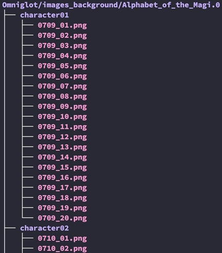
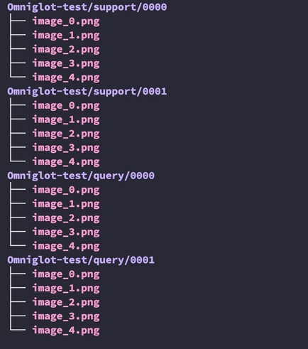
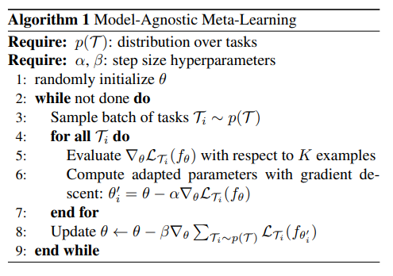

# 实验七：基于Omniglot数据集的迁移学习和元学习实践
## 实验任务
本次实验旨在通过Few-Shot分类任务理解迁移学习和元学习核心思想，共包含两个任务：**基于迁移学习的基线模型训练**（10分钟）和**MAML元学习模型实现**（20分钟）。

[下载任务一和任务二代码](https://github.com/umnooob/course-demo/blob/main/docs/lab7/DL2025_lab7_Meta_Learning.ipynb){ .md-button}

[下载训练集](https://box.nju.edu.cn/f/06579572abb542249517/?dl=1){ .md-button}

[下载测试集](https://box.nju.edu.cn/f/9508a9c341344d6e9164/?dl=1){ .md-button}

---

### 数据集说明
**Omniglot数据集**包含50种文字系统中的1623个手写字符，每个字符由20个不同书写者绘制。数据集划分为：
- 训练/验证集：30种文字系统
   - 每个文字系统中有多种文字
   - 每个文字有20张图像

- 测试集：640对支持集和查询集
   - 5张支持图像
   - 5张查询图像

- 测试集标签说明：

数据集下载代码将在提供的Jupyter Notebook中自动执行。

---

## 实验任务详解
### 任务一：迁移学习基线模型
#### 任务描述
1. **数据构造**：从训练集中随机选取5个Task
2. **模型构建**：一个简单的5层卷积神经网络，代码已在提供的Jupyter Notebook给出
3. **训练流程**：
   - 阶段一：在随机选取的5个Task数据上预训练分类模型
   - 阶段二：在5个支撑集上微调
   - 阶段三：在查询集推理

---

### 任务二：MAML元学习模型
#### 任务描述
1. **MAML核心思想**：
   - 在任务分布上学习一组**全局初始化参数**
   - 通过少量梯度更新快速适应新任务
2. **实现步骤**：
   1. 采样任务批次（每批含32个Task）
   2. 内循环（Inner Loop）：在每个Task的支撑集上执行梯度更新
   3. 外循环（Outer Loop）：基于查询集损失更新元模型参数
<!-- 3. **超参数建议**：
   - 超参数已在提供的Jupyter Notebook给出
   - 对 K-way N-shot中的K和N两个参数进行消融实验
      - 5-way 1-shot
      - 5-way 3-shot
      - 5-way 5-shot
      - 10-way 1-shot
      - 10-way 3-shot
      - 10-way 5-shot -->

#### 算法伪代码
  
（注：实际代码中将提供完整PyTorch实现）

---

## 实验资源

- [MAML原论文](https://arxiv.org/pdf/1703.03400.pdf)
- [PyTorch元学习库Torchmeta参考](https://github.com/tristandeleu/pytorch-meta)

---

## 实验提交
提交截止前需提供以下材料：

1. **代码文件**：
   - 完整可运行的Jupyter Notebook（含任务一、二实现）

2. **实验报告**（PDF格式）：
   
   | 内容要求                | 分值占比 |
   |-------------------------|----------|
   | 1. 绘制验证集准确率和任务数量的关系图   | 20%      |
   | 2. 一句话描述验证集准确率和任务数量的关系  | 5%      |
   | 3. 阅读[论文](https://arxiv.org/abs/1810.09502)并写出一个使用MAML时可能出现的问题  | 25%      |
   | 4. 解释上一问的问题为什么会出现并给出你的解决方法      | 25%      |
   | 5. 描述你对源代码做了哪些改进以提高测试准确率    | 25%      |

3. **性能指标**（基线模型 vs MAML在5-way 1-shot任务上的测试准确率）：
   
   | 性能要求（可叠加）                | 加分 |
   |-------------------------|----------|
   |  基线模型acc>0.6  | +5分      |
   |  MAML acc>0.7  | +5分      |
   |  MAML acc>0.9 | +5分      |
   |  MAML acc>0.95      | +5分      |
